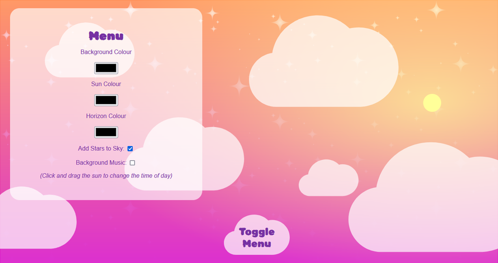

## Table of Contents
- [Description](#description)
- [Lessons Learned](#lessons-learned)
- [Credits](#credits)

## Description

The purpose of this project was to create a relaxing experience with a simple, intuitive interface. It uses React.js components to update the sun and sky colours in real time so users can enjoy the colour transitions that happen as they drag the sun along the screen and their cursor around the colour input boxes. The game can be played by clicking the banner above, or via my website [here]([https://kbest.ca/sunset-maker/])
  
Another goal of this project was to become familiar with another Javascript library, as I've previously coded primarily using the jQuery library. The code was written in VS Code, and Git Bash & GitHub were used for version control.

## Lessons Learned

- Functional and Class Components and the strengths & weaknesses of each
- Deploying a react app using git, and using cPanel
- How React's real-time updating affects functions such as "onload"
- How to use & style React's native Draggable elements without z-index conflicts

# Credits

Star vectors: [Yulia Gapeenko](https://www.vecteezy.com/vector-art/2476491-set-of-original-stars-sparkle-firework-decoration-twinkle-shiny-flash-icon)

Background Music: [Ashot Danielyan](https://pixabay.com/users/ashot-danielyan-composer-27049680/)
